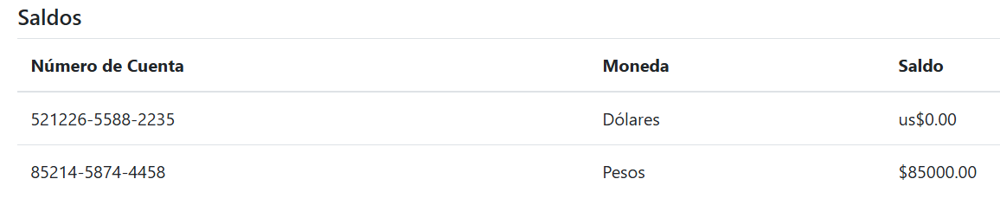
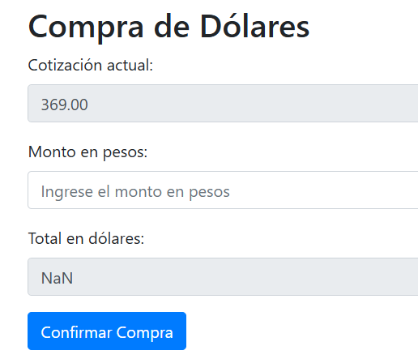
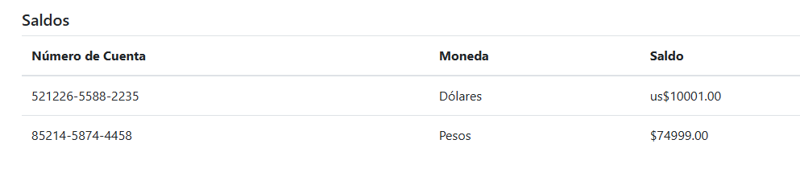

## 💵 Desafío: Hackeando transacciones – Compra de divisas

### 🧠 Descripción del caso

Un banco está al borde de la quiebra. Los balances no coinciden y faltan muchos dólares. En redes sociales, un anónimo afirma haber comprado dólares a un precio increíblemente bajo. Nuestra misión es investigar si el sistema de conversión de divisas es vulnerable y, de ser así, aprovechar la falla para comprar **más de 10.000 USD**.

---

### 📌 Caso

**Compra de divisas**

> *Un banco está muy cerca de la quiebra. Los balances no coinciden, le faltan muchos dólares. En Twitter, un anónimo publicó que pudo comprar dólares muy baratos.*  
> *¿Podrás comprar más de 10.000 USD?*

---

### 📷 Estado inicial

El sistema muestra dos cuentas disponibles: una en **pesos** y otra en **dólares**. Inicialmente contamos con **$85.000 pesos** y **us$0 dólares**.



---

### 🛒 Formulario de compra

Al acceder al menú de compra, se nos presenta un formulario con:

- Cotización actual (fijada en $369)
- Monto en pesos a ingresar
- Cálculo automático del total en dólares



---

### 🔍 Análisis técnico

Al interceptar la solicitud con Burp Suite al hacer clic en "Confirmar Compra", observamos:

```http
POST / HTTP/2
Host: chl-xxxx-compra-divisas.softwareseguro.com.ar
...
Content-Type: application/x-www-form-urlencoded
...
Cookie: session=eyJ1c2VyIjp7ImFyc19tb25leSI6ODUwMDAsInVzZF9tb25leSI6MH19...
...
cotizacion=369.00&monto=3690000&total=10000.00
```

Claramente se observa que el cliente envía **todos los valores numéricos clave** en el `body` del POST: **cotización, monto en pesos y total en dólares**. Esto indica que **la lógica de validación está completamente del lado cliente**, lo cual es una mala práctica.

---

### 💥 Explotación

Aprovechando esta debilidad, modificamos los valores antes de que se envíen al servidor:

- Mantenemos `total=10000.00`
- Cambiamos `cotizacion=369.00` por `cotizacion=1.00`
- Mantenemos un `monto` inflado para evitar validaciones por monto bajo

Esto genera la ilusión de una transacción válida desde el punto de vista del servidor, que **no recalcula** el valor real.

---

### ✅ Resultado

Después de enviar la petición modificada, el saldo reflejado muestra más de **us$10.000 dólares**, lo cual confirma la vulnerabilidad.



---

### 🔓 Vulnerabilidad encontrada

Este es un claro caso de **falta de validación del lado del servidor**:

- La lógica de negocio se ejecuta completamente del lado cliente.
- El servidor **confía en los valores enviados**, sin recalcular ni verificar la cotización real ni el saldo suficiente.
- Esto permite manipular el valor de `cotizacion`, `monto` o `total` libremente.

---

### 🧪 Impacto

Cualquier atacante con acceso a las herramientas adecuadas (como Burp Suite) puede:
- Comprar montos elevados de divisas sin tener el dinero necesario.
- Alterar la cotización para obtener beneficios injustos.
- Manipular balances y causar pérdidas al sistema.

