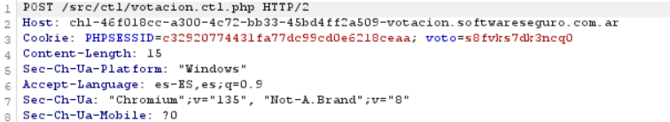
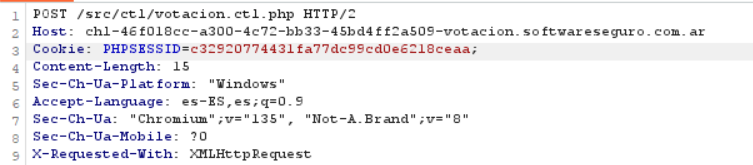

## 🗳️ Desafío: Broken Access Control – Sistema de votación (versión simple)

### 🧠 Descripción del caso

En este desafío analizamos un sistema de votación en línea vulnerable a **Broken Access Control**. El backend permitía emitir votos mediante una solicitud HTTP `POST` simple, y el único control para evitar múltiples votos por usuario era una cookie llamada `voto`, establecida después del primer envío exitoso.

---

### 📌 Caso

**Votación**

> *Un compañero me acaba de enviar un link de una página que realiza una extraña votación, en la cual participa nuestra facultad. Estaría bueno que votes, ¿podrá ganar la UTN?*

Este mensaje fue el disparador del análisis: tras ingresar al sitio y observar el comportamiento del sistema, comenzamos a evaluar posibles fallos en el control de acceso.

---

### 🔍 Análisis técnico

- **Método:** `POST`  
- **Endpoint:** `/src/ctl/votacion.ctl.php`  
- **Parámetro enviado:** `opUniversidad=1`

**Cabeceras relevantes:**
```http
Cookie: PHPSESSID=ed0bbe67c304610b192751bab4ec82ea;
```

Luego del primer voto, el servidor respondía con:

```http
Set-Cookie: voto=XYZ...
```

La cookie `voto` se utilizaba para bloquear nuevos votos desde el mismo navegador.

---

### 🛠️ Explotación

Al eliminar la cookie `voto` antes de cada envío, el sistema no detectaba que el usuario ya había votado, y aceptaba la solicitud como si fuera un nuevo voto.

#### ✅ Ejemplo de bypass:
```python
"Cookie": "PHPSESSID=...;"  # sin la cookie `voto=...`
```


Esto permitió automatizar el proceso y enviar múltiples votos modificando únicamente esa cabecera.

---

### 🔓 Vulnerabilidad encontrada

Este comportamiento evidencia un **Broken Access Control**, debido a que:

- El único control era del lado cliente (cookie fácilmente manipulable).
- No se validaba el estado de la sesión ni se implementaban mecanismos antifraude.
- No existía control por IP, usuario autenticado ni tokens temporales.

---

### 🧪 Script de explotación

El script utilizado automatiza el envío de múltiples votos omitiendo la cookie de control.

📁 Ya subido al repo en: [`broken-access-control/votacion.py`](./votacion.py)

