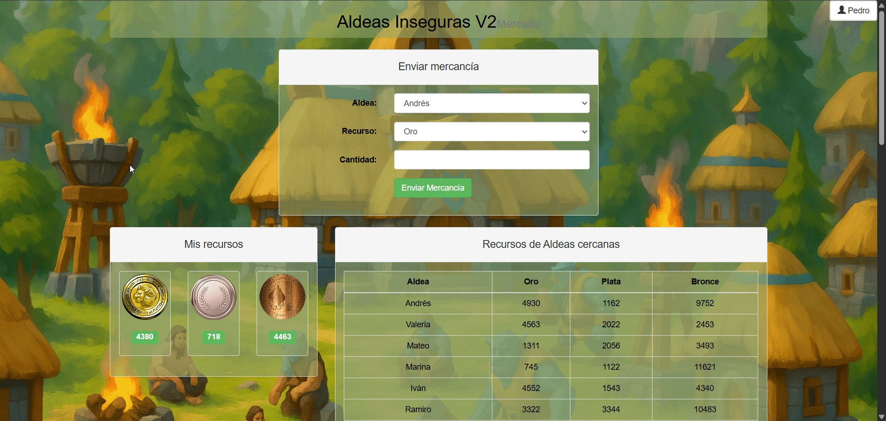
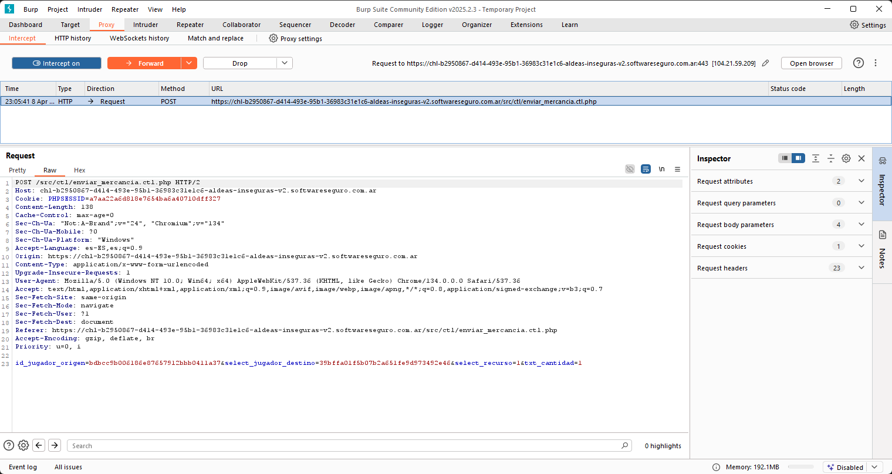
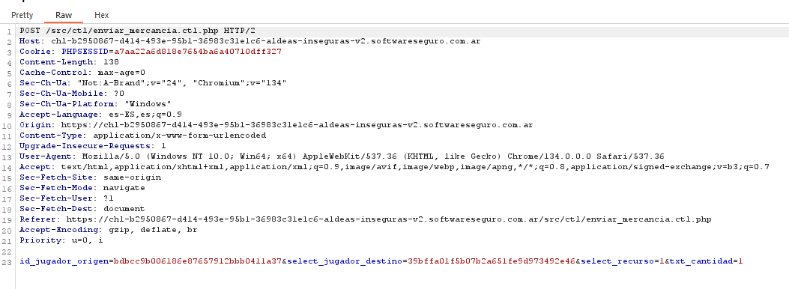

# Reto: Aldeas Inseguras V2 🏰

Este fue uno de los retos que resolvimos en el training de ciberseguridad de GISSIC-UTN, y la verdad estuvo buenísimo porque no hizo falta romper nada técnico. Solo usar la lógica en contra del juego.

---

## ✨ Descripción del desafío

Aldeas Inseguras V2 es un juego ambientado en la Edad Media, donde deberás administrar tu propia aldea y hacerla crecer en recursos y seguridad. Tu amigo Pedro, fanático de este mundo, está buscando adquirir una nueva aldea fortificada, pero para hacerlo necesita reunir una gran cantidad de recursos: **34.000** de oro, **38.000** de plata y **56.000** de bronce.

Lamentablemente, juntar semejante cantidad no es fácil, y Pedro necesita tu ayuda. ¿Estás dispuesto a colaborar para que pueda alcanzar su objetivo?

Reglas del juego: Cada jugador cuenta con 3 tipos de recursos: 🥇 oro, 🥈 plata y 🥉 bronce. Cada aldea puede recibir oro una vez por día, pero puede enviar oro las veces que quiera a distintas aldeas. Los otros recursos no tienen ningún tipo de limitación.

> El objetivo era ayudar a Pedro a conseguir:
> - 🏆 34.000 de oro
> - 🏅 38.000 de plata
> - 🏆 56.000 de bronce

El juego se juega desde el navegador. Cada jugador puede recibir **oro solo una vez por día**, pero **puede enviarlo ilimitadamente**. Plata y bronce no tienen restricciones.

---

## 🎮 Interfaz del juego

Desde el panel podés elegir una aldea, el recurso y la cantidad a enviar. Te muestra también los recursos disponibles en tu aldea y en las cercanas.

---

## 🚀 Estrategia para romper el juego

La clave del reto no era hackear el servidor ni meterle inyecciones raras, sino **romper la lógica del juego**. Lo que hicimos fue:

1. Descubrimos que los IDs de las aldeas estaban en UUID.
2. Notamos que el servidor **no validaba que el id_jugador_origen coincidiera con la sesión activa**. Boom: **IDOR**.
3. Podíamos hacer que cualquier aldea enviara recursos a quien quisiéramos, mientras supiéramos su ID.
4. Capturamos la petición con **Burp Suite**:

5. Con eso, automatizamos una **cadena de envíos**. Es decir:
   - Valeria envía a Iván
   - Iván a Benjamín
   - Benjamín a Elena...
   - Y el último me lo manda a mí

6. Repetimos eso para oro, plata y bronce (en peticiones separadas).
7. Como el oro sólo puede recibirse 1 vez por día, hicimos que **cada jugador reciba solo una vez**, y los demás solo envíen.

---

## 📊 Resultado

💰 Llegamos a:
- 35.602 de oro
- 40.944 de plata
- 64.140 de bronce

Pedro se armó la aldea de su vida 🏡

---

## 💡 Lecciones del reto

- No todo bug es técnico, muchos están en la lógica.
- Las validaciones del lado del cliente o solo confiando en IDs son peligrosas.
- Si un servidor no verifica bien la sesión... está regalado.
- Este tipo de vulnerabilidad es un **IDOR (Insecure Direct Object Reference)** pero de tipo acción.

---

## ⚖️ Herramientas usadas

- Burp Suite (Community) para capturar las requests
- Python + requests para automatizar la cadena de envíos

